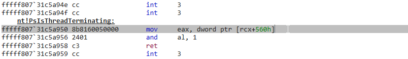
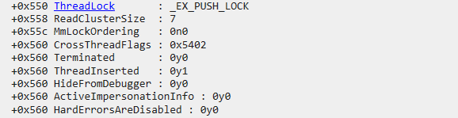

# KWorld

KWorld is a kernel driver for removing the anti-debugging technique ThreadHideFromDebugger from processes.

https://github.com/colinsenner/KWorld/assets/13701799/dd3bfc58-9b09-429f-b81c-c40d1b63640c

## Tested on

* Windows 11 Pro, 64-bit (Build 22631.3155) 10.0.22631 (Fully-patched 2/19/2024)
* VMWare Workstation 17 Pro (17.5.0 build-22583795)

## How it works

ThreadHideFromDebugger is a technique used by malware to hide from debuggers. It works by calling `NtSetInformationThread` with an undocumented argument `ThreadHideFromDebugger (0x11)` information class. This causes the thread to be hidden from debuggers. This makes the process crash immediately because the debugger is unable to handle the exception. 

KWorld goes through all threads in the process and removes the `ThreadHideFromDebugger` flag from each thread. This allows the process to be debugged without crashing.

## Usage

KWorld comes with the following projects

* **KmdWorld** - Kernel driver (C)
* **KThreadUnhide** - User-mode application (C# WPF .NET 8.0)
* **KThreadUnhideCLI** - Console user-mode application (C++)
* **NoBreakpointsAllowed** - Test application (C++)

You can run `NoBreakpointsAllowed.exe` and attempt to attach a debugger to it (It calls `Kernel32!Sleep` once per second). Then run `.\KThreadUnhideCLI.exe <pid>` and attempt to attach a debugger to `NoBreakpointsAllowed.exe` again. You will see that the process does not crash and you can debug it. 

You can run `DebugView` from [SysInternals](https://learn.microsoft.com/en-us/sysinternals/downloads/debugview) to see the all debug output from the KmdWorld driver.

## Detailed explanation

Since offsets in the `_ETHREAD` and `_EPROCESS` structures can differ between Windows versions, I lookup the offsets once at runtime. We need to find the offset of the `ThreadHideFromDebugger` flag in the `_ETHREAD` structure. I do this by finding the function `PsIsThreadTerminating` in `ntoskrnl.exe`. The first instruction of this function is 

Where `560h` is the offset of the `CrossThreadFlags` in the `_ETHREAD` structure. Bit 3 of `CrossThreadFlags` is the `HideFromDebugger` flag.

## Setup instructions for VMWare

[VMWare Setup for Kernel Debugging](SETUP.md)

## WinDBG command reference

[WinDBG command reference](WINDBG.md)
